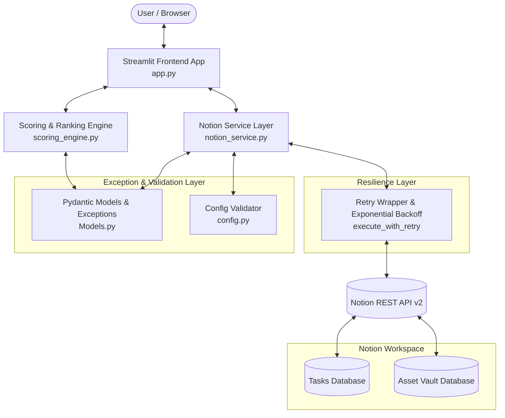
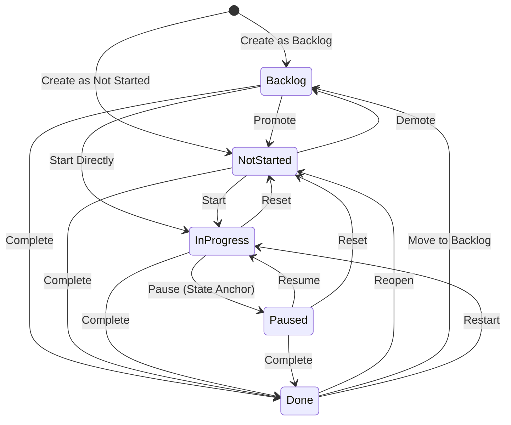
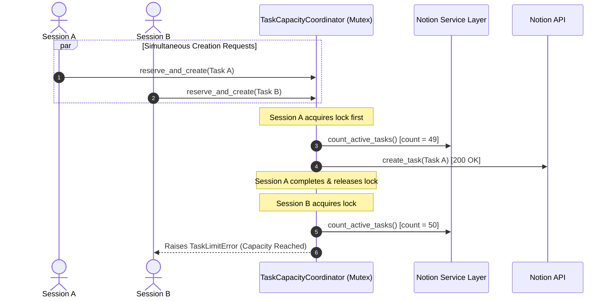
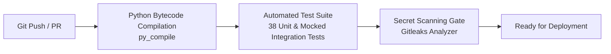

# Technical Architecture & Design Document

## 1. System Overview

The **Second Brain Execution Engine** is a high-performance productivity cockpit built to eliminate cognitive friction and decision fatigue. Unlike standard todo applications that merely list items, this system acts as an algorithmic triage engine that pulls active tasks from Notion, prioritizes them via a multi-factor scoring formula, and surfaces a laser-focused top-3 execution queue.



---

## 2. Core Architectural Components

### 2.1 Presentation & State Management Layer (`app.py`)
- **Framework**: Streamlit (wide layout, responsive containers).
- **Custom UI System**: Vanilla CSS injecting warm amber themes (`#B45309`), custom hero headers with base64-encoded background imagery, button state micro-transitions, and dialog modals.
- **Session State**: Manages `active_page`, `active_domain`, and `pause_prompt_id` dynamically across hot-reloads and reruns.
- **Modal Dialogs**: Uses Streamlit `@st.dialog` for non-disruptive task capture and destructive deletion confirmations without losing focus.
- **Defensive Rendering**: Escapes dynamic Notion strings (`escape_markdown`) to prevent formatting breaks or prompt injections.

### 2.2 Domain, Data Validation & Exception Layer (`Models.py`)
- Built on **Pydantic v2** (`BaseModel`, `Field`, `Literal`).
- Ensures runtime validation, strict bounds on numerical inputs ($1 \le \text{impact} \le 5$, $0.25 \le \text{estimated\_hours} \le 12.0$), and standardized types across Notion API serialization/deserialization.
- **`TaskModel`**: Encapsulates task attributes, status, domain, impact, urgency, blockers, state anchor notes, and computed priority scores.
- **`AssetModel`**: Encapsulates reusable knowledge items, tags (`Field(default_factory=list)`), URLs, and categorical domains.
- **Typed Custom Exceptions**:
  - `SecondBrainError`: Base application exception.
  - `TaskValidationError`: Raised for missing/malformed task inputs.
  - `TaskLimitError`: Raised when the advisory task limit is reached.
  - `InvalidStateTransitionError`: Raised when an illegal state change is requested.
  - `NotionServiceError`: Raised when an external Notion API operation fails.

### 2.3 Task Lifecycle & State Transition Engine
Task status transitions are strictly governed by `VALID_STATE_TRANSITIONS`. Status changes are validated both in the service layer before writing to Notion and mapped to UI indicators.



#### Valid State Transition Matrix
| Current State | Allowed Next States |
|---|---|
| **Not started** | `In progress`, `Backlog`, `Done` |
| **In progress** | `Paused`, `Done`, `Not started` |
| **Paused** | `In progress`, `Done`, `Not started` |
| **Backlog** | `Not started`, `Done`, `In progress` |
| **Done** | `Not started`, `Backlog`, `In progress` |

### 2.4 Algorithmic Scoring Engine (`scoring_engine.py`)
- Pure, side-effect-free functional module.
- Calculates an objective **Priority Score** for each task using multi-factor weighted parameters:

$$\text{Priority Score} = (\text{Impact} \times 2.0) + \text{Urgency} + \text{Blocker Bonus} + (\text{Estimated Hours} \times 1.5)$$

Where:
- $\text{Blocker Bonus} = 5.0$ if $\text{Someone Waiting?} = \text{True}$, else $0.0$.
- **Sorting Rule**: Tasks with status `In progress` are always pinned to the top of the queue. Remaining tasks are sorted descending by `priority_score`.

### 2.5 Notion Integration & Resilience Layer (`notion_service.py`)
- Implements the adapter pattern over the official `notion-client` SDK.
- Translates Notion's nested property structures (`Title`, `Select`, `Status`, `Number`, `Checkbox`, `Rich Text`) into strongly-typed Pydantic models with defensive property extractors (`_parse_int_prop`, `_parse_float_prop`, `_extract_plain_text`).
- **Transient Fault Tolerance (`execute_with_retry`)**:
  - Automatically handles HTTP `429` (Rate Limited), `500`, `502`, `503`, `504` status codes and request timeouts.
  - Applies bounded exponential backoff with randomized jitter:
    $$\text{Delay} = \min(\text{base\_delay} \times 2^{\text{attempt}-1} + \text{jitter}, \text{max\_delay})$$
- **Performance-Optimized Startup & Compensating Rollback (`start_task`)**:
  - Resuming `"Paused"` tasks skips template inspection queries, avoiding unnecessary network latency.
  - Initial startup for `"Not started"` tasks checks `TEMPLATE_MARKER_HEADING` to idempotently inject execution checklists without creating duplicate blocks.
  - **Template Injection Retry & Compensating Rollback**: If template injection fails after status transition, `start_task` automatically retries up to 3 times with exponential backoff. If all attempts fail, it executes a compensating rollback reverting the task status back to its original state (e.g. `'Not started'`) and raises `NotionServiceError`, preventing orphaned tasks in `'In progress'` without their checklist.

---

## 3. Data Flow & Execution Pipeline

```mermaid
sequenceDiagram
    autonumber
    actor User
    participant App as Streamlit UI (app.py)
    participant Engine as Scoring Engine
    participant Notion as Notion Service
    participant Retry as Retry Wrapper
    participant API as Notion API

    User>>App: Opens Dashboard / Selects Domain Filter
    App>>Notion: fetch_active_tasks(domain)
    Notion>>Retry: execute_with_retry(databases.query)
    Retry>>API: POST /v1/databases/{id}/query
    API>>Retry: 200 OK Raw JSON Pages
    Retry>>Notion: Filtered Results
    Notion>>App: List[TaskModel]
    App>>Engine: rank_tasks(tasks)
    Engine>>App: Sorted & Pinned Task Queue
    App>>User: Renders Top 3 Arena + Backlog Drawer

    opt User clicks "Start Task" (Unstarted with Retry & Rollback)
        User>>App: Click 'Start'
        App>>Notion: start_task(id, current_status='Not started')
        Notion>>Retry: update_task_status('In progress')
        Retry>>API: PATCH /v1/pages/{id}
        loop Template Injection Retry (Up to 3 attempts)
            Notion>>Retry: inject_template_blocks_if_empty(id)
            Retry-->>API: POST /v1/blocks/{id}/children
        end
        alt All Template Injection Attempts Fail
            Notion->>Retry: Compensating Rollback: update_task_status('Not started')
            Retry->>API: PATCH /v1/pages/{id} (Reverted)
            Notion-->>App: Raises NotionServiceError
            App-->>User: Displays error notification; task remains Not started
        else Template Injected Successfully
            App>>User: Refreshes with task pinned in focus & checklist initialized
        end
    end

    opt User clicks "Resume Task" (Paused)
        User>>App: Click 'Resume'
        App>>Notion: start_task(id, current_status='Paused')
        Note over Notion: Skips block inspection roundtrip
        Notion>>Retry: update_task_status(id, 'In progress')
        Retry>>API: PATCH /v1/pages/{id}
        App>>User: Refreshes with task resumed immediately
    end

    opt User clicks "Pause Task" (State Anchor Protocol)
        User>>App: Click 'Pause'
        App>>User: Display State Anchor Prompt
        User>>App: Inputs next physical action note & submits
        App>>Notion: update_task_status(id, 'Paused', state_anchor)
        Notion>>Retry: execute_with_retry(pages.update)
        Retry>>API: PATCH /v1/pages/{id}
        App>>User: Task paused with state anchor preserved
    end
```

---

## 4. The State Anchor Protocol

Cognitive science shows that task interruption causes severe attention residue. When returning to a paused task, users waste significant energy figuring out where they left off.

The **State Anchor Protocol** solves this:
1. When a user clicks **Pause**, the application intercepts the action.
2. It prompts: *"What is the exact next 15-minute physical action to take when resuming?"*
3. The answer is committed directly to the Notion page's `State Anchor` property alongside the `"Paused"` status.
4. When the task appears again in the Execution Arena, the anchor note is prominently surfaced in an information badge.

---

## 5. Concurrency Model & Backend-Controlled Counter Strategy

### 5.1 Backend Concurrency Coordinator (`TaskCapacityCoordinator`)
- **Problem**: When multiple user sessions simultaneously invoke task creation near capacity, a naive read-then-create (`fetch_active_tasks -> create_task`) sequence can suffer from race conditions (Time-of-Check to Time-of-Use / TOCTOU), allowing multiple concurrent requests to pass the count check and overshoot `MAX_ACTIVE_TASKS`.
- **Solution**: The backend implements `TaskCapacityCoordinator` utilizing a thread-safe mutual exclusion lock (`threading.Lock`):
  1. **Atomic Reservation**: Acquires the lock before reading active tasks.
  2. **Capacity Assertion**: If $\text{Active Tasks} \ge \text{MAX\_ACTIVE\_TASKS}$, immediately aborts and raises `TaskLimitError` before initiating any Notion REST calls.
  3. **Synchronized Creation**: Executes Notion page creation and invalidates the cached task list within the critical section.
  4. **Strict Capacity Enforcement**: Eliminates concurrent creation interleaving across multi-threaded Streamlit user sessions.



### 5.2 Config & Bounds Validation
- `config._parse_max_active_tasks` validates `MAX_ACTIVE_TASKS` on startup, enforcing valid positive integers within range ($1 \le \text{MAX\_ACTIVE\_TASKS} \le 500$) with actionable error messages for malformed environment deployments.

### 5.3 Server-Side Logging & Client Error Sanitization
- All unexpected errors and external API failures are logged server-side via Python's standard `logging` library (`logger.exception()`) with full stack traces.
- Presentation layers in `app.py` expose sanitized, user-friendly feedback to prevent leaking sensitive API tokens, database IDs, or internal network topology.

---

## 6. CI/CD Quality Gates & Security Infrastructure

The project includes an automated Continuous Integration pipeline ([`.github/workflows/ci.yml`](file:///d:/Second-Brain/.github/workflows/ci.yml)) executed on every push and pull request:



1. **Bytecode Compilation**: Validates syntax across all source files via `python -m py_compile`.
2. **Automated Test Suite**: Executes 38 comprehensive unit and integration tests across:
   - `test_models.py`: Data models, bounds validation, and state machine transitions.
   - `test_scoring_engine.py`: Multi-factor priority calculations and pinning rules.
   - `test_notion_parsing.py`: Defensive Notion JSON property extractors and markdown escaping.
   - `test_notion_service.py`: Retry wrappers, API error recovery, idempotency, and status updates.
   - `test_config.py`: Environment configuration bounds and error handling.
3. **Automated Secret Scanning**: Runs `gitleaks` across the commit history to enforce zero-secret commitments.