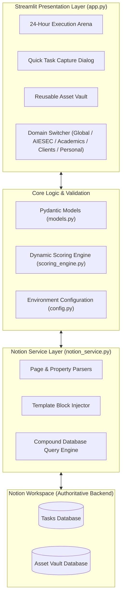

<div align="center">

# Second Brain Execution Engine
### Algorithmic Task Scoring, State Anchoring and Frictionless Notion Cockpit

<p align="center">
  <b>A high-leverage execution cockpit that eliminates decision fatigue by mathematically ranking tasks, automating Notion workflows, and eliminating task-switching friction through State Anchoring.</b>
</p>

[Key Features](#key-features) •
[Architecture](#system-architecture) •
[Priority Formula](#dynamic-priority-scoring-algorithm) •
[Quickstart](#quickstart-guide) •
[Notion Setup](#notion-database-setup) •
[Documentation](#documentation)

---

</div>

## Why Second Brain Execution Engine?

Standard to-do lists fail because they present flat, overwhelming backlogs that lead to analysis paralysis. 

The **Second Brain Execution Engine** transforms your Notion task database into an active **24-Hour Execution Arena**:
- **Zero Ambiguity:** Always surfaces the top 3 highest-leverage tasks to execute right now.
- **Mathematical Triage:** Dynamic prioritization based on impact, urgency, estimated duration, and blocker status.
- **Context Preservation:** Pausing a task forces you to capture a "State Anchor" to resume immediately without mental friction.
- **Automated Scoping:** Notion pages automatically receive execution checklists the moment a task begins.

---

## Key Features

| Feature | Description |
| :--- | :--- |
| **24-Hour Execution Arena** | Surfaces and pins the **Top 3** highest-priority tasks. Active (`In Progress`) tasks are always pinned at the top. |
| **Algorithmic Scoring** | Dynamically calculates weighted priority scores based on strategic impact, urgency, estimated hours, and team blockers. |
| **State Anchor Protocol** | When pausing, captures the exact next 15-minute physical action into Notion to eliminate restart inertia. |
| **Template Injection** | Injects an `Execution Scope & Checklist` structure into empty Notion pages the moment a task starts. |
| **Backlog Drawer** | An expandable overflow queue for lower-ranked items with one-click **Promote** actions. |
| **Reusable Asset Vault** | Searchable knowledge vault to retrieve guides, templates, and links filtered by operational domain. |
| **Quick Task Capture** | Low-friction in-app form for instant capture with customized domain and weighting parameters. |
| **Domain Filtering** | One-click context switching across **Global HUD**, **AIESEC**, **Academics**, **Clients**, and **Personal** workspaces. |

---

## System Architecture



---

## Dynamic Priority Scoring Algorithm

The Second Brain Execution Engine replaces subjective decision-making with a deterministic mathematical scoring model implemented in `scoring_engine.py`:

$$\text{Priority Score} = (\text{Impact} \times 2.0) + \text{Urgency} + \text{Blocker Bonus} + (\text{Estimated Hours} \times 1.5)$$

### Parameter Breakdown

| Parameter | Scale | Weight / Multiplier | Description |
| :--- | :--- | :--- | :--- |
| **Impact** | 1 – 5 | $\times 2.0$ | Strategic value, revenue leverage, or mission alignment. |
| **Urgency** | 1 – 5 | $\times 1.0$ | Proximity of deadline or immediate time-sensitivity. |
| **Someone Waiting?** | Boolean | $+ 5.0$ (Blocker Bonus) | Injects immediate priority if a teammate or client is blocked. |
| **Estimated Hours** | 0.25 – 12.0 | $\times 1.5$ | Balances high-effort deliverables against quick wins. |

### Sorting & Pinning Rule
1. **Active Focus Pin:** Any task currently marked `In progress` is unconditionally pinned to the top of the Arena.
2. **Backlog Ranking:** All other active tasks are sorted in descending order of their computed `Priority Score`.

---

## Quickstart Guide

### Prerequisites
- Python 3.10 or higher
- A Notion account with API access

### 1. Clone & Set Up Environment
```bash
git clone https://github.com/Tuhinshu/Second-Brain.git
cd Second-Brain

# Create and activate virtual environment
python -m venv .venv

# Windows
.venv\Scripts\activate

# macOS / Linux
source .venv/bin/activate

# Install dependencies
pip install -r requirements.txt
```

### 2. Configure Environment Variables
Create a `.env` file in the root directory:
```env
NOTION_API_KEY=ntn_your_notion_api_key_here
NOTION_TASKS_DB_ID=your_tasks_database_id_here
NOTION_ASSETS_DB_ID=your_assets_database_id_here
MAX_ACTIVE_TASKS=50
```

### 3. Launch the Cockpit
```bash
streamlit run app.py
```
The application will open automatically in your browser at `http://localhost:8501`.

---

## Notion Database Setup

The execution engine integrates with two Notion databases:

### 1. Tasks Database (Required)
Configure your Notion Tasks table with the following exact property names:

| Property Name | Property Type | Options / Format |
| :--- | :--- | :--- |
| **Task Name** | Title | Text |
| **Status** | Status / Select | `Not started`, `In progress`, `Paused`, `Done`, `Backlog` |
| **Domain** | Select | `AIESEC`, `Academics`, `Clients`, `Personal` |
| **Impact** | Number | 1 – 5 |
| **Urgency** | Number | 1 – 5 |
| **Estimated Hours** | Number | Number (e.g., 1.0, 2.5) |
| **Someone Waiting?** | Checkbox | Boolean |
| **State Anchor** | Text (Rich text) | Stores physical restart note when paused |

### 2. Asset Vault Database (Optional)
Configure an Asset Vault table with: `Title` (Title), `Type` (Select), `Domain` (Select), `URL` (URL), and `Tags` (Multi-select).

> [!TIP]
> For detailed step-by-step database creation and integration connection steps, see [**NOTION_SETUP.md**](file:///d:/Second-Brain/NOTION_SETUP.md).

---

## Documentation

- [**Technical Architecture & Design (`ARCHITECTURE.md`)**](file:///d:/Second-Brain/ARCHITECTURE.md) – Detailed system components, state flow diagrams, and protocols.
- [**Notion Setup Guide (`NOTION_SETUP.md`)**](file:///d:/Second-Brain/NOTION_SETUP.md) – Step-by-step database provisioning and API token retrieval.
- [**Contributing Guidelines (`CONTRIBUTING.md`)**](file:///d:/Second-Brain/CONTRIBUTING.md) – Development standards, branch conventions, and PR workflow.
- [**License (`LICENSE`)**](file:///d:/Second-Brain/LICENSE) – MIT License.
